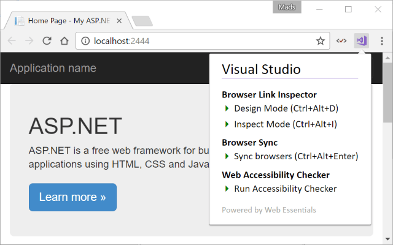
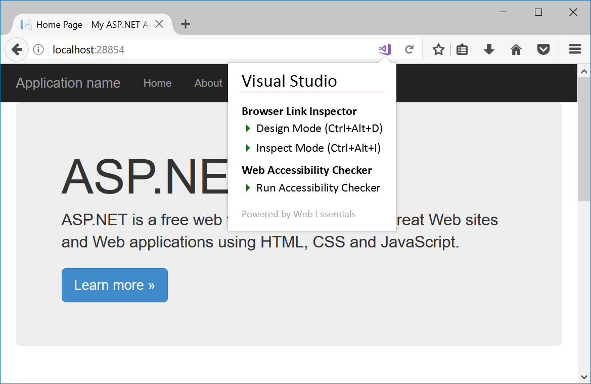

# Web Essentials browser extension

## Download and install 
- [Google Chrome](https://chrome.google.com/webstore/detail/web-essentials/mghdcdlpcdiodelbplncnodiiadljhhk)
- [Firefox](https://addons.mozilla.org/en-US/firefox/addon/webessentials/)

Exposes Browser Link functionality directly from the Google Chrome toolbar or Firefox address bar.

### Chrome

### Firefox

## Supported Visual Studio extension

- [Browser Link Inspector 2017](https://marketplace.visualstudio.com/items?itemName=MadsKristensen.BrowserLinkInspector2017)
- [Browser Sync](https://marketplace.visualstudio.com/items?itemName=MadsKristensen.BrowserSync)
- [W3C Validator](https://marketplace.visualstudio.com/items?itemName=MadsKristensen.W3CValidator)
- [Web Accessibility Checker](https://marketplace.visualstudio.com/items?itemName=MadsKristensen.WebAccessibilityChecker)

## Developer notes
Enable Chrome's extension developer mode and add the `src` path as a new extension. Then load the `test/testpage.html` in the browser.